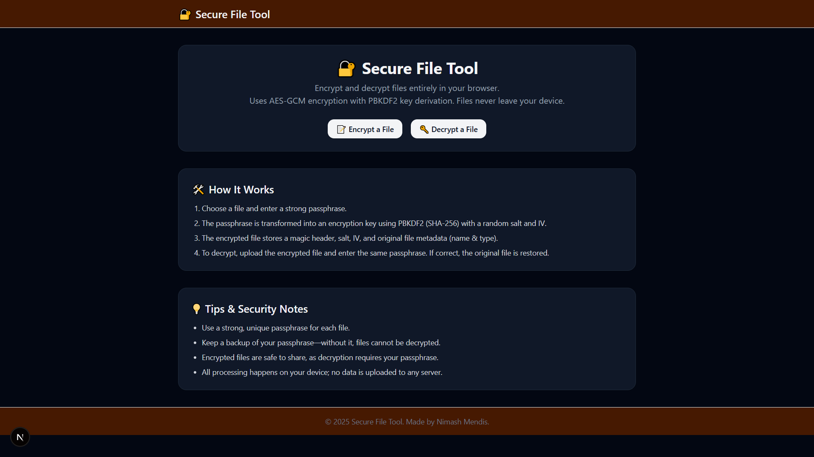
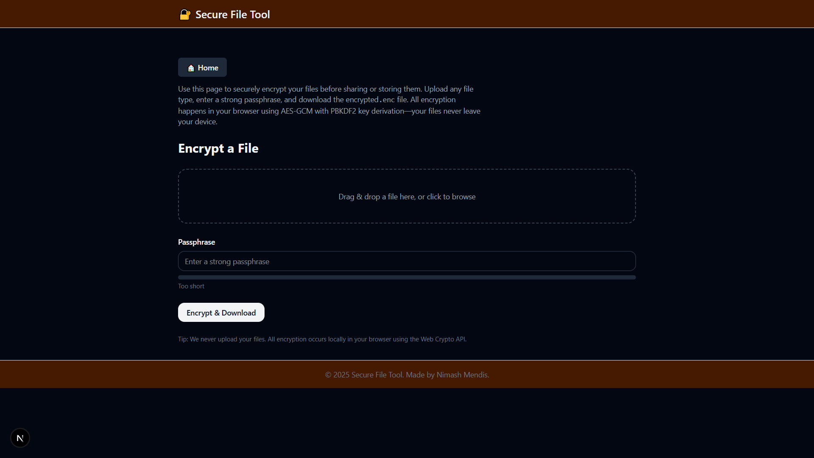
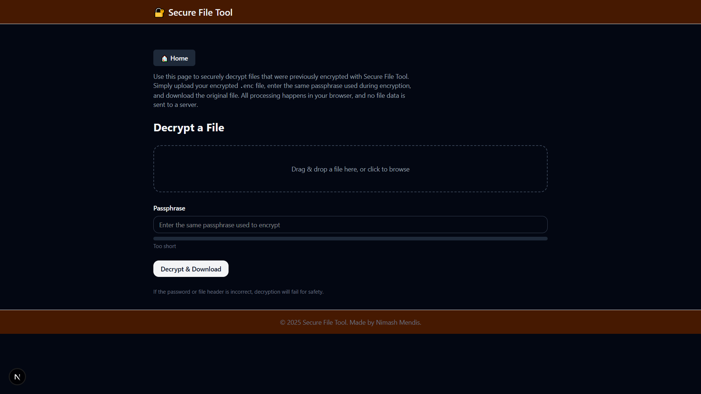

# 🔐 Secure File Tool

- A modern web application for encrypting and decrypting files entirely in your browser. Supports AES-GCM and AES-CBC encryption with PBKDF2 key derivation. All files are processed locally—no data is ever uploaded to a server.

## Features

- File Upload & Drag-and-Drop.

- Password-Based Encryption
Encrypt files with a strong passphrase. Key derived via PBKDF2 (SHA-256) with random salt and IV.

- File Decryption

- Multiple Algorithms
Choose between AES-GCM (authenticated encryption) and AES-CBC.

- 100% Client-Side

## Images





## Demo Link

- Demo Link: [Secure File Tool](https://secure-file-tool.vercel.app)

## Tech Stack

- Frontend: Next.js (TypeScript)
- UI: TailwindCSS
- Crypto: Web Crypto API (AES-GCM, AES-CBC, PBKDF2)
- State Management: React hooks

## Installation
```bash
# Clone repository
git clone https://github.com/yourusername/secure-file-tool.git
cd secure-file-tool

# Install dependencies
npm install

# Run development server
npm run dev
```
- Open http://localhost:3000 to view the app.

## Usage

- Navigate to Encrypt a File or Decrypt a File.
- Upload your file using drag-and-drop or file selection.
- Select the encryption algorithm (AES-GCM or AES-CBC).
- Enter a strong passphrase.
- Click Encrypt & Download or Decrypt & Download.
- The processed file will be downloaded with .enc extension (for encrypted) or restored original file.

## Security Notes

- Always use a strong, unique passphrase.
- Keep your passphrase safe; without it, files cannot be decrypted.
- All files are encrypted/decrypted locally; no data is sent to any server.
- Encrypted files are safe to share.
- AES-GCM is preferred for authenticated encryption; AES-CBC does not include integrity/authentication.

## Contact 

- For questions, suggestions, or feedback, reach out via email: [Nimash Mendis](emailto:nimash.mendis0202@gmail.com)